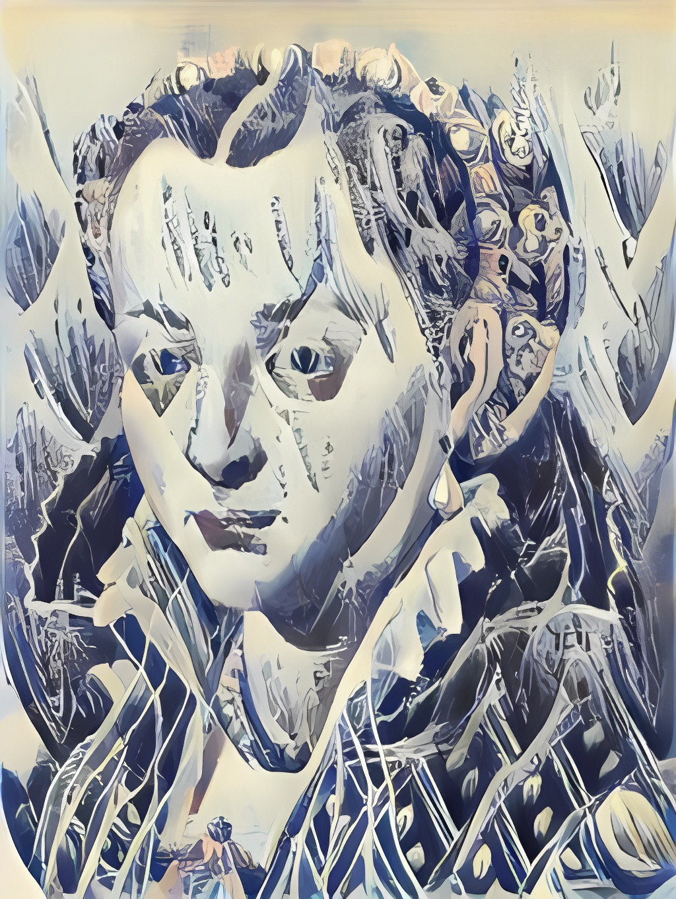
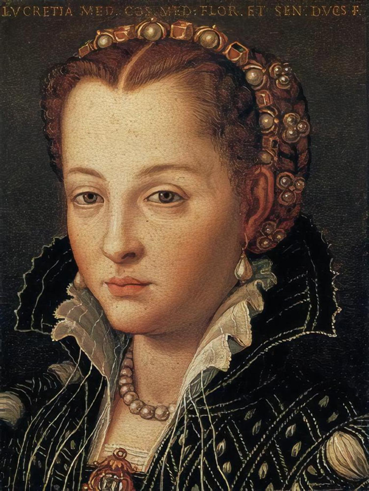

# 🧠 Deep Learning Final Project – Spring 2024

This repository showcases a comprehensive deep learning project that covers multiple computer vision tasks including classification, object detection, segmentation, and neural style transfer. Models were trained and evaluated using CIFAR-10, Tiny ImageNet, ADE20K, and custom datasets.

---

## 📁 Project Structure

| Folder       | Contents |
|--------------|----------|
| `code/`      | Jupyter Notebooks for each experiment |
| `datasets/`  | CSVs and dataset files |
| `images/`    | Style/content images and output results |
| `models/`    | Trained models (`.h5` files) |
| `docs/`      | Report and visuals |

---

## 🧪 Experiments & Models

### ✅ Classification
- **Custom CNN** on CIFAR-10
- Final Test Accuracy: **75.6%**

### ✅ Transfer Learning
- **VGG19**: 61.9%
- **ResNet50**: 36.8%

### ✅ Fine-tuning
- Custom CNN on **Tiny ImageNet**
- Final Accuracy: **0.6%** (200-class challenge)

### ✅ Object Detection
- **YOLOv8** on self-driving car dataset
- Detects cars, trucks, pedestrians, etc. with bounding boxes

### ✅ Semantic Segmentation
- **SegFormer** (Transformer-based model)
- Dataset: ADE20K (150 classes)
- IoU: ~0.97 on sample set

### ✅ Neural Style Transfer
- Transfers artistic style to content images using CNN feature extraction

---

## 🖼️ Sample Output (Style Transfer)

| Content | Style | Output |
|---------|-------|--------|
|  |  |  |

---

## 🚀 How to Run

1. Clone the repository:
```bash
git clone https://github.com/BHARGAVATEJABORRA/deep-learning-final-project-SP24.git
cd deep-learning-final-project-SP24
